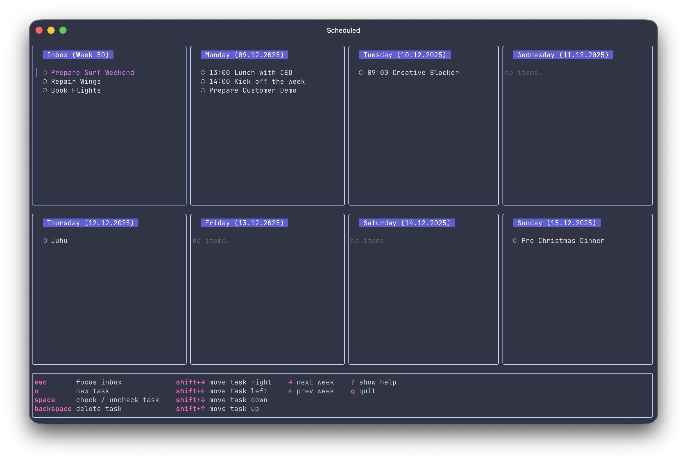

# Scheduled

Scheduled is a TUI based rolling task manager that focus on a single work week. 

## Setup

### iTerm2 on MacOS

Go to Preferences > Profiles tab. Select your profile on the left, and then open the Keyboard tab. At the bottom is a set of buttons that lets you select the behavior of the Option key. For most users, Esc+ will be the best choice, especially to make the alt+num shortcut work to focus a specific tab.

### Ghostty on MacOS

macos-option-as-alt = true

## Roadmap

### Feature: Task Pinning 

### Feature: Contexts

### Feature: Task Popup

Hitting <enter> on a task opens a task popup with title and decription field. The popup allows to edit the tasks title and its description. Esc quits the popup without saving, save updates the task in the underlying repository. The implementation shoud use this (Bubble)[https://github.com/rmhubbert/bubbletea-overlay]q
